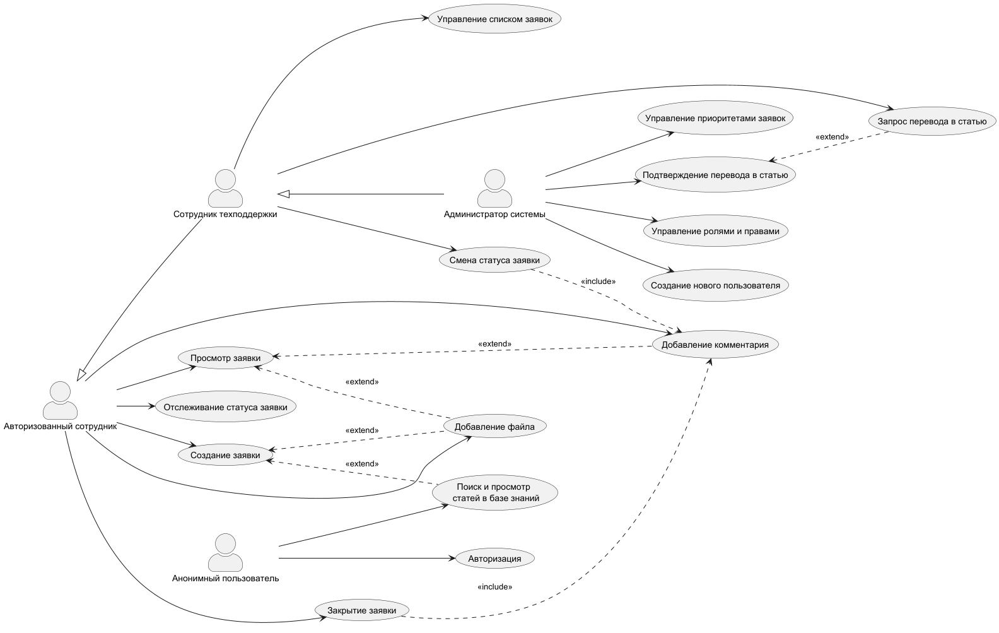

## Блок 2. Документация процессов

### Задание 2.1: Use Case Diagram - Use Case
**Анонимный пользователь**
- Поиск и просмотр статей БЗ
- Авторизация

**Авторизованный сотрудник**
- Поиск и просмотр статей БЗ
- Создание заявки
- Просмотр заявки
- Отслеживание статуса заявки
- Добавление комментария
- Добавление файла
- Закрытие заявки

**Сотрудник техподдержки** (наследует Авторизованного сотрудника)
- Управление списком заявок
- Смена статуса заявки
- Запрос перевода в статью

**Администратор** (наследует Сотрудника техподдержки)
- Подтверждение перевода в статью
- Управление ролями и правами
- Создание нового пользователя
- Управление приоритетами заявок
### Задание 2.2: Use Case Diagram - Определение Extend и Include

Include-связи

| Базовый Use Case     | Включаемый Use Case    | Обоснование                                |
| -------------------- | ---------------------- | ------------------------------------------ |
| Закрытие заявки      | Добавление комментария | Нельзя закрыть заявку без указания причины |
| Смена статуса заявки | Добавление комментария | При смене статуса нужно указать причину    |

Extend-связи

| Базовый Use Case                | Расширяющий Use Case          | Обоснование                                           |
| ------------------------------- | ----------------------------- | ----------------------------------------------------- |
| Создание заявки                 | Поиск и просмотр статей БЗ    | Пользователь может проверить наличие решения (кнопка) |
| Создание заявки                 | Добавление файла              | Опциональное прикрепление файла                       |
| Просмотр заявки                 | Добавление комментария        | Опциональное дополнение                               |
| Просмотр заявки                 | Добавление файла              | Опциональное прикрепление файла                       |
| Подтверждение перевода в статью | Объединение с похожей статьей | Опциональное объединение                              |

### Задание 2.3: Use Case Diagram - Создание с помощью PlantUML
```
```@startuml  
'https://plantuml.com/use-case-diagram  
  
left to right direction  
skinparam actorStyle awesome  
  
actor "Анонимный пользователь" as Anonymous  
actor "Авторизованный сотрудник" as Employee  
actor "Сотрудник техподдержки" as Support  
actor "Администратор системы" as Admin  
  
usecase "Поиск и просмотр \n статей в базе знаний" as UC_Search  
usecase "Авторизация" as UC_Authorization  
  
usecase "Создание заявки" as UC_Create  
usecase "Просмотр заявки" as UC_View  
usecase "Отслеживание статуса заявки" as UC_Tracking  
usecase "Добавление комментария" as UC_AddComment  
usecase "Добавление файла" as UC_AddFile  
usecase "Закрытие заявки" as UC_Close  
  
usecase "Управление списком заявок" as UC_Managing  
usecase "Смена статуса заявки" as UC_Change  
usecase "Запрос перевода в статью" as UC_Request  
  
usecase "Подтверждение перевода в статью" as UC_Confirm  
usecase "Управление ролями и правами" as UC_Admin  
usecase "Создание нового пользователя" as UC_AddUser  
usecase "Управление приоритетами заявок" as UC_Priority  
  
Anonymous --> UC_Search  
Anonymous --> UC_Authorization  
  
Employee --> UC_Create  
Employee --> UC_View  
Employee --> UC_Tracking  
Employee --> UC_AddComment  
Employee --> UC_AddFile  
Employee --> UC_Close  
  
Support --> UC_Managing  
Support --> UC_Change  
Support --> UC_Request  
  
Admin --> UC_Confirm  
Admin --> UC_Admin  
Admin --> UC_AddUser  
Admin --> UC_Priority  
  
  
Support -up-|> Employee  
Admin -up-|> Support  
  
UC_Close ..> UC_AddComment : <<include>>  
UC_Change ..> UC_AddComment : <<include>>  
  
UC_Create <.. UC_Search : <<extend>>  
UC_Create <.. UC_AddFile : <<extend>>  
UC_View <.. UC_AddFile : <<extend>>  
UC_View <.. UC_AddComment : <<extend>>  
UC_Confirm <.. UC_Request : <<extend>>  
@enduml
```




