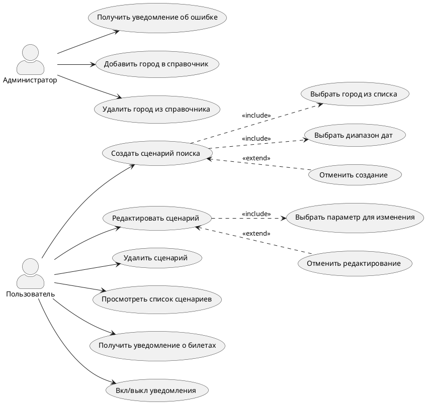
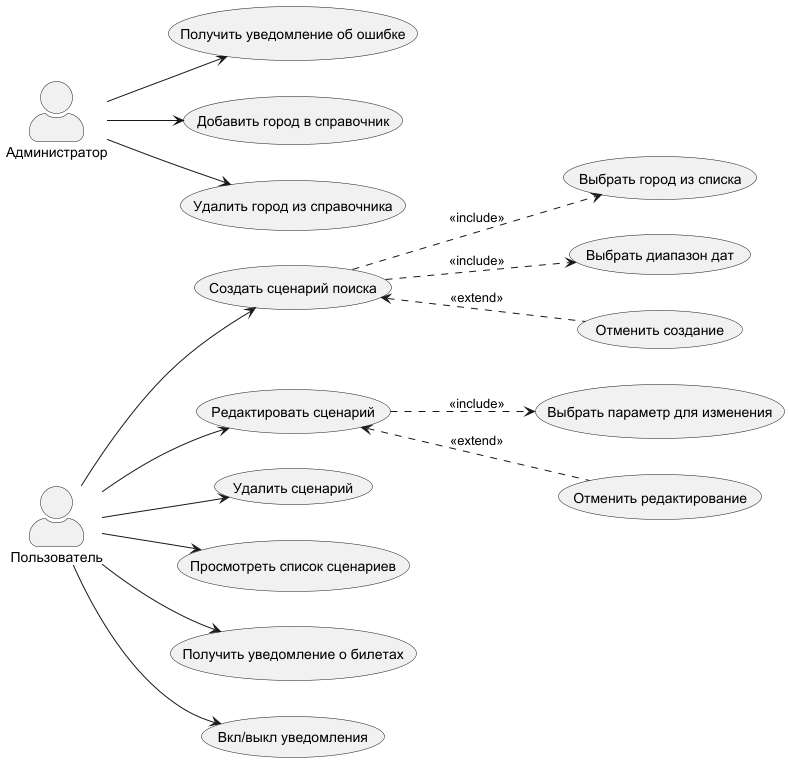

# 1. Use Case Diagram

### Акторы
- **Пользователь** (обычный)   
- **Администратор**

### Use Cases (основные)

Для пользователя:
- Создать сценарий поиска
- Редактировать сценарий   
- Удалить сценарий    
- Просмотреть список сценариев   
- Получить уведомление о билетах    
- Включить/отключить уведомления    
- Выбрать город из списка    

Для администратора:
- Получить уведомление об ошибке  
- Управлять справочником городов (добавить/удалить)    

### Связи (include/extend)

**Include** (обязательное включение):

- `Создать сценарий` → `Выбрать город вылета`
- `Создать сценарий` → `Выбрать город прилета`
- `Создать сценарий` → `Выбрать диапазон дат`
- `Редактировать сценарий` → `Выбрать параметр для изменения`

**Extend** (расширение, опционально):

- `Создать сценарий` ← `Отменить создание` (пользователь может прервать)
- `Редактировать сценарий` ← `Отменить редактирование`

### Код диаграммы (PlantUML)

### Результат

# 2. User Story
Сценарий - это единица поиска льготных билетов в рамках одного маршрута и одного временного промежутка для определенного пользователя.
## US 1
> **Заголовок:** Получение уведомления о появлении льготных билетов  
> **Как** пользователь,  
> **я хочу** получать мгновенное уведомление в telegram,  
> **когда для моего активного "сценария поиска" находятся льготные билеты,**  
> **чтобы** одним кликом перейти к покупке до того, как билеты закончатся.

**Критерии приемки (AC):**

1. Уведомление отправляется **только** при появлении билетов, соответствующих критериям сценария (маршрут, дата, льготный тариф).
2. Уведомление содержит:
    - Название сценария (например, "Москва - Благовещенск, 15-20 июля").
    - Дату и время вылета.
    - Стоимость билета.
    - Прямую ссылку на страницу покупки этого билета.
3. Пользователь может включить/отключить уведомления для каждого сценария в его настройках.
    

## US 2
Я, как пользователь, хочу указывать диапазон дат поиска, чтобы поиск был более гибким и подходил мне.
> **Заголовок:** Задание гибкого диапазона дат в сценарии поиска  
> **Как** пользователь, создающий сценарий,  
> **я хочу** указывать как конкретную дату, так и диапазон дат (от и до) для вылета,  
> **чтобы** охватить более широкие возможности для поездки и увеличить шансы найти льготный билет.

**Критерии приемки (AC):**

1. При создании сценария есть два режима: "Конкретная дата" и "Диапазон дат".
2. В режиме "Диапазон дат" обязательно указываются поля "Дата вылета с" и выбирается диапазон поиска.
3. Система ищет билеты на **каждый день** в указанном диапазоне.
4. Максимальная длина диапазона — 30 дней (защита от злоупотреблений).

## US 3
> **Заголовок:** Просмотр списка всех моих сценариев поиска  
> **Как** зарегистрированный пользователь,  
> **я хочу** видеть на одной странице таблицу или список всех моих активных и неактивных сценариев с их ключевыми параметрами,  
> **чтобы** быстро проверить их актуальность, отредактировать или управлять ими.

**Критерии приемки (AC):**

1. При выборе функции "Мои сценарии" отображаются все активные сценарии пользователя с информацией о: маршруте, диапазоне дат, дата создания сценария.
2. Для каждого сценария есть дополнительная функция: "Редактировать", "Удалить"

## US 4
> **Заголовок:** Быстрый выбор городов вылета/прилёта  
> **Как** новый пользователь,  
> **я хочу** видеть список кликабельных городов вылета/прилёта (например, Москва, Санкт-Петербург, Благовещенск, Хабаровск),  
> **чтобы** создать свой первый сценарий в один клик, без необходимости что-то вводить.

**Критерии приемки (AC):**
1. Список содержит города, доступные для поиска в системе.
2. Выбор происходит кликом по варианту из списка.

## US 5
> **Заголовок:** Удаление сценариев поиска  
> **Как** пользователь, просматривающий свои сценарии,  
> **я хочу** иметь возможность удалить сценарий безвозвратно,  
> **чтобы** гибко управлять потоком уведомлений и поддерживать список в актуальном состоянии.

**Критерии приемки (AC):**

1. В интерфейсе списка сценариев для каждого есть четкая кнопка "Удалить".
2. При нажатии "Удалить" появляется окно подтверждения ("Вы уверены? Действие необратимо").
3. После удаления сценарий пропадает из списка, и поиск по нему прекращается.

## US 6
> **Заголовок:** Редактирование сценариев поиска  
> **Как** пользователь, просматривающий свои сценарии,  
> **я хочу** иметь возможность внести изменения в сценарий,  
> **чтобы** поддерживать список в актуальном состоянии.

**Критерии приемки (AC):**

1. В интерфейсе списка сценариев для каждого есть четкая кнопка "Редактировать".
2. При нажатии "Редактировать" появляется пошаговая программа, которая в режиме диалога вносит изменения. 
3. После редактирования сценария появляется окно подтверждения ("Вы уверены? Действие необратимо").

## US ADM1
> **Заголовок:** Мониторинг системы  
> **Как** администратор  
> **я хочу** иметь возможность получения уведомлений об ошибках системы,  
> **чтобы** оперативно реагировать и устранять ошибки.

**Критерии приемки (AC):**

1. Уведомление отправляется **только** при возникновении ошибки системы.
2. Уведомление содержит текст ошибки, идентификатор сценария.

## US ADM2
> **Заголовок:** Управление справочниками  
> **Как** администратор  
> **я хочу** иметь возможность добавлять и удалять города вылета/прилёта из списка поддерживаемых,  
> **чтобы** актуализировать список городов вылета/прилёта.

**Критерии приемки (AC):**

1. При добавлении города в справочник пользователь сможет его выбрать на этапе создания сценария.

**Критерий отката:**
При удалении города из справочника система проверяет, нет ли активных сценариев с этим городом. Если есть — уведомить администратора и предложить отменить удаление.

# 3. Use Case

## UC 1

| Название Use Case       | Регистрация нового сценария поиска льготного  билета                                                                                                                                                                                                                                                                                                                                                                                                                                                                                                                                                                                                                                                                                                                                                                                                                                                                                                                                                                                                                                                                                        |
| ----------------------- | ------------------------------------------------------------------------------------------------------------------------------------------------------------------------------------------------------------------------------------------------------------------------------------------------------------------------------------------------------------------------------------------------------------------------------------------------------------------------------------------------------------------------------------------------------------------------------------------------------------------------------------------------------------------------------------------------------------------------------------------------------------------------------------------------------------------------------------------------------------------------------------------------------------------------------------------------------------------------------------------------------------------------------------------------------------------------------------------------------------------------------------------- |
| Актор                   | Пользователь                                                                                                                                                                                                                                                                                                                                                                                                                                                                                                                                                                                                                                                                                                                                                                                                                                                                                                                                                                                                                                                                                                                                |
| Предусловие             | 1. Пользователь авторизован в Telegram и начал диалог с ботом.   2. Бот активен и доступен.   3. Пользователь имеет активную сессию (не истек таймаут).                                                                                                                                                                                                                                                                                                                                                                                                                                                                                                                                                                                                                                                                                                                                                                                                                                                                                                                                                                               |
| Основной сценарий       | Поток: Пользователь последовательно заполняет все обязательные параметры  1. Пользователь инициирует создание сценария (команда /new или кнопка "Создать сценарий"). 2. Система запрашивает город вылета, предлагая интерфейс выбора (кнопки с городами). 3. Пользователь выбирает город вылета. 4. Система подтверждает город вылета. 5. Пользователь выбирает город прилёта. 6. Система подтверждает город прилёта. При успехе запрашивает дату начала поиска, показывая календарь или принимая текст в формате ДД.ММ.ГГГГ. 7. Пользователь указывает дату начала. 8. Система валидирует дату (не раньше текущего дня) и запрашивает дату окончания поиска (или предлагает вариант "по конкретной дате"). 9. Пользователь указывает дату окончания. 10. Система валидирует дату (не раньше даты начала, диапазон не превышает N дней) и выполняет финальную проверку всего сценария. 11. Система создает сценарий, сохраняет его, запускает поисковую задачу и отправляет пользователю итоговое сообщение: "Сценарий создан! Я буду искать билеты из {Москвы} в {Благовещенск} с {01.08} по {15.08}." |
| Альтернативный сценарий | А.1: Пользователь отменяет создание на любом этапе 1. Пользователь отправляет команду /cancel. 2. Система отменяет процесс, удаляет временные данные и сообщает: "Создание сценария отменено."  А.2: Введены некорректные или неподдерживаемые данные даты 1. Система обнаруживает ошибку валидации. 2. Система отправляет сообщение об ошибке с примером корректного ввода. 3. Система повторно запрашивает тот же параметр. 4. Поток возвращается к соответствующему шагу основного потока.  А.3: Пользователь превысил лимит на сценарии 1. На шаге финальной проверки (п.10 осн. потока) система проверяет лимит. 2. Если лимит превышен, система сообщает: "Достигнут лимит в {N} активных сценариев. Удалите один из существующих, чтобы создать новый." 3. Use Case завершается неудачей.                                                                                                                                                                                                                                                                                                  |
| Постусловие             | 1. Новый сценарий с уникальным ID создан и сохранен в базе данных.   2. Сценарий имеет статус "Активен".   3. Запущена фоновая задача (job) для периодического поиска по заданным параметрам.   4. Пользователю отправлено подтверждающее уведомление в Telegram.                                                                                                                                                                                                                                                                                                                                                                                                                                                                                                                                                                                                                                                                                                                                                                                                                                                                  |
|                         |                                                                                                                                                                                                                                                                                                                                                                                                                                                                                                                                                                                                                                                                                                                                                                                                                                                                                                                                                                                                                                                                                                                                             |

## UC 2

| Название Use Case       | Внесение изменений в  сценарий поиска льготного  билета                                                                                                                                                                                                                                                                                                                                                                                                                                                                                                                                                                                                                                                                                                                                                                                                                                        |
| ----------------------- | ---------------------------------------------------------------------------------------------------------------------------------------------------------------------------------------------------------------------------------------------------------------------------------------------------------------------------------------------------------------------------------------------------------------------------------------------------------------------------------------------------------------------------------------------------------------------------------------------------------------------------------------------------------------------------------------------------------------------------------------------------------------------------------------------------------------------------------------------------------------------------------------------- |
| Актор                   | Пользователь                                                                                                                                                                                                                                                                                                                                                                                                                                                                                                                                                                                                                                                                                                                                                                                                                                                                                   |
| Предусловие             | 1. Пользователь имеет хотя бы один активный сценарий.                                                                                                                                                                                                                                                                                                                                                                                                                                                                                                                                                                                                                                                                                                                                                                                                                                          |
| Основной сценарий       | Поток: Пользователь последовательно выполняет команды  1. Пользователь инициирует внесение изменения сценария (команда /change или кнопка "Изменить сценарий"). 2. Система предлагает активные сценарии пользователя 3. Пользователь выбирает сценарий, в который он бы хотел внести изменения. 4. Система предлагает интерфейс выбора параметра, в который нужно внести изменения.  5. Пользователь выбирает параметр. 6. Система предлагает варианты изменения. 7. Пользователь вносит изменения. 8. Система отображает полные параметры сценария.  9. Пользователь выполняет финальную проверку всего сценария. Подтверждает верность.  10. Система изменяет сценарий, сохраняет его, запускает поисковую задачу и отправляет пользователю итоговое сообщение: "Сценарий изменён! Я буду искать билеты из {Москвы} в {Благовещенск} с {01.08} по {15.08}." |
| Альтернативный сценарий | А.1: Пользователь отменяет внесение изменений на любом этапе 1. Пользователь отправляет команду /cancel. 2. Система отменяет процесс, удаляет временные данные и сообщает: "Внесение изменений отменено."  А.2: Введены некорректные или неподдерживаемые данные даты 1. Система обнаруживает ошибку валидации. 2. Система отправляет сообщение об ошибке с примером корректного ввода. 3. Система повторно запрашивает тот же параметр. 4. Поток возвращается к соответствующему шагу основного потока.   А.3: Пользователь пытается изменить параметры сценария, но новый маршрут больше не поддерживается (город удален из справочника). Система сообщает об ошибке и предлагает выбрать другой город или отменить изменения.                                                                                                                              |
| Постусловие             | 1. В сценарий внесены изменения и сохранены в базу данных.   2. Сценарий имеет статус "Активен".   3. Запущена фоновая задача (job) для периодического поиска по заданным параметрам.   4. Пользователю отправлено подтверждающее уведомление в Telegram.                                                                                                                                                                                                                                                                                                                                                                                                                                                                                                                                                                                                                             |
|                         |                                                                                                                                                                                                                                                                                                                                                                                                                                                                                                                                                                                                                                                                                                                                                                                                                                                                                                |
## UC 3

| Название Use Case       | Удаление активного сценария поиска льготных билетов                                                                                                                                                                                                                                                                                                                                                                                                                                                                                                                                                                             |
| ----------------------- | ------------------------------------------------------------------------------------------------------------------------------------------------------------------------------------------------------------------------------------------------------------------------------------------------------------------------------------------------------------------------------------------------------------------------------------------------------------------------------------------------------------------------------------------------------------------------------------------------------------------------------- |
| Актор                   | Пользователь                                                                                                                                                                                                                                                                                                                                                                                                                                                                                                                                                                                                                    |
| Предусловие             | 1. Пользователь имеет хотя бы один активный сценарий.                                                                                                                                                                                                                                                                                                                                                                                                                                                                                                                                                                           |
| Основной сценарий       | Поток: Пользователь последовательно выполняет команды  1. Пользователь инициирует удаление сценария (команда /delete или кнопка "Изменить сценарий"). 2. Система предлагает активные сценарии пользователя 3. Пользователь выбирает сценарий, который он хотел бы удалить. 4. Система предлагает подтвердить удаление выбранного сценария. 5. Пользователь подтверждает удаление. 6. Система меняет статус сценария на удалённый, сохраняет его, останавливает поисковую задачу и отправляет пользователю итоговое сообщение: "Сценарий удалён! Билеты из {Москвы} в {Благовещенск} с {01.08} по {15.08}." |
| Альтернативный сценарий |                                                                                                                                                                                                                                                                                                                                                                                                                                                                                                                                                                                                                                 |
| Постусловие             | 1. Сценарий помечен как удалённый.   2. Остановлена фоновая задача (job) для периодического поиска по заданным параметрам.   3. Пользователю отправлено подтверждающее уведомление в Telegram.                                                                                                                                                                                                                                                                                                                                                                                                                            |
|                         |                                                                                                                                                                                                                                                                                                                                                                                                                                                                                                                                                                                                                                 |

