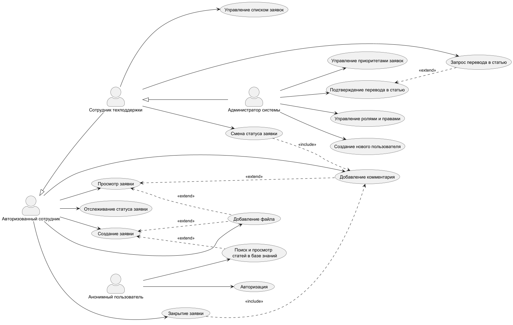

# Задача 1
## Блок 1. Работа с требованиями
### Задание 1.1: Стейкхолдеры

**Стейкхолдер: Бизнес-заказчик**
Боль: Высокие операционные издержки (деньги компании) из-за отвлечения ценных специалистов на типовые вопросы и снижение производительности труда сотрудников, которые ждут ответа.
Цель: Внедрить самообслуживание (база знаний) и автоматизацию, чтобы снизить нагрузку на поддержку и ускорить возвращение сотрудников к работе.

**Стейкхолдер: Сотрудник техподдержки (Оператор 1-й линии)**
Боль: Много одинаковых типовых вопросов, которые можно решить без привлечения специальной помощи. Демотивация из-за рутинной работы.
Цель: Чтобы сложные и интересные задачи было легко отличить от простых, и чтобы на простые задачи уходило 5 секунд, а не 5 минут. Увеличить процент решаемости на первой линии (First Call Resolution) за счет доступа к базе знаний

**Стейкхолдер: Сотрудник (внутренний пользователь)**
Боль: При возникновении проблемы обращение в тех.поддержку занимает много времени, хотя проблема может быть решена быстро и самостоятельно.
Цель: Иметь возможность самообслуживания и быстрого создания заявок на решение проблем, которые не найдены в базе знаний.

**Стейкхолдер: Техлид**
Боль: Риск накопления технического долга из-за размытых требований и необходимости частых изменений (если API будет неудобным, фронтенд-разработчики будут дергать его каждые 5 минут).
Цель: Получить четкий контракт (OpenAPI / proto-файлы) на старте, чтобы фронтенд и бэкенд команды могли работать параллельно, и архитектура сервиса позволяла легко вносить изменения.

**Стейкхолдер: Сотрудник отдела ИБ**
Боль: Риски утечки данных и Контроль доступа.
Цель: Аудит действий (кто что смотрел) и шифрование канала (HTTPS/gRPC), также включает разграничение ролей.

**Стейкхолдер: Административный департамент**
Боль: При устройстве нового работника долгое оформление заявки на создание нового пользователя и техническое его обеспечение. 
Цель: При оформление нового работника автоматическое формирование заявки для администратора ИС.

### Задание 1.2: Виды требований

**Функциональные требования:**
1) Система должна обеспечивать полнотекстовый поиск по заголовкам и содержимому статей базы знаний с поддержкой морфологии русского языка (чтобы находить «мышь» и по запросу «мышки»).
2) Система должна предоставлять пользователю форму для создания тикета с обязательными полями: тема, описание, приоритет. 
3) Система должна отображать пользователю текущий статус его тикета (например: «Открыт», «В работе», «Решен»).
4) система должна иметь возможность вывести специалисту тех.поддержки задачи в порядке приоритета
5) Система должна предоставлять сотруднику техподдержки функционал «Опубликовать как статью» для закрытого тикета, которая скопирует содержимое тикета в форму создания новой статьи базы знаний.
6) Система должна поддерживать вход в систему по сертификату MTLS.

**Нефункциональные требования:**
1) веб-интерфейс должен корректно отображаться в актуальных версиях браузеров (Chrome, Firefox, Edge) без использования устаревших технологий (ActiveX, Flash).
2) Взаимодействие между клиентом и сервером должно быть защищено от атак Man-in-the-Middle. Система должна поддерживать шифрование трафика по протоколу TLS 1.2 или выше.
3) База знаний должна быть масштабируема, с увеличением количества статей время поиска не должно занимать больше 10 секунд.

### Задание 1.3: Архитектурно-значимые требования

1) Система должна использовать существующую базу данных MySQL, как источник данных для Базы знаний с учётом разграничения прав доступа.
2) Система должна работать не только по сети, но и автономно в отделениях с синхронизацией раз в день.
3) При падении одного узла системы, пользователи не должны заметить проблемы.

### Задание 1.4: Декомпозиция требований

Функция: Сотрудник хочет создать заявку в техподдержку
1) открыть форму
2) заполнение поле темы
3) просмотр списка вариантов решения проблемы из базы знаний по ключевым словам из  поля темы
	3.1)  Система автоматически выполняет поиск по базе знаний после заполнения поля "Тема"
	3.2) Система отображает список найденных статей под полем ввода
4) выбор варианта решения из предложенного 
	4.1) Пользователь выбирает статью и переходит к её чтению.
	4.2. Если статья не решает проблему, пользователь возвращается к форме создания заявки (все поля заполнены)
5) заполнение поле описания проблемы
6) прикрепление файла при необходимости
7) отправить заявку
8) Система проверяет заполнение обязательных полей

## Блок 2. Документация процессов

### Задание 2.1: Use Case Diagram - Use Case
**Анонимный пользователь**
- Поиск и просмотр статей БЗ
- Авторизация

**Авторизованный сотрудник**
- Поиск и просмотр статей БЗ
- Создание заявки
- Просмотр заявки
- Отслеживание статуса заявки
- Добавление комментария
- Добавление файла
- Закрытие заявки

**Сотрудник техподдержки** (наследует Авторизованного сотрудника)
- Управление списком заявок
- Смена статуса заявки
- Запрос перевода в статью

**Администратор** (наследует Сотрудника техподдержки)
- Подтверждение перевода в статью
- Управление ролями и правами
- Создание нового пользователя
- Управление приоритетами заявок
### Задание 2.2: Use Case Diagram - Определение Extend и Include

Include-связи

| Базовый Use Case     | Включаемый Use Case    | Обоснование                                |
| -------------------- | ---------------------- | ------------------------------------------ |
| Закрытие заявки      | Добавление комментария | Нельзя закрыть заявку без указания причины |
| Смена статуса заявки | Добавление комментария | При смене статуса нужно указать причину    |

Extend-связи

| Базовый Use Case                | Расширяющий Use Case          | Обоснование                                           |
| ------------------------------- | ----------------------------- | ----------------------------------------------------- |
| Создание заявки                 | Поиск и просмотр статей БЗ    | Пользователь может проверить наличие решения (кнопка) |
| Создание заявки                 | Добавление файла              | Опциональное прикрепление файла                       |
| Просмотр заявки                 | Добавление комментария        | Опциональное дополнение                               |
| Просмотр заявки                 | Добавление файла              | Опциональное прикрепление файла                       |
| Подтверждение перевода в статью | Объединение с похожей статьей | Опциональное объединение                              |

### Задание 2.3: Use Case Diagram - Создание с помощью PlantUML
```
```@startuml  
'https://plantuml.com/use-case-diagram  
  
left to right direction  
skinparam actorStyle awesome  
  
actor "Анонимный пользователь" as Anonymous  
actor "Авторизованный сотрудник" as Employee  
actor "Сотрудник техподдержки" as Support  
actor "Администратор системы" as Admin  
  
usecase "Поиск и просмотр \n статей в базе знаний" as UC_Search  
usecase "Авторизация" as UC_Authorization  
  
usecase "Создание заявки" as UC_Create  
usecase "Просмотр заявки" as UC_View  
usecase "Отслеживание статуса заявки" as UC_Tracking  
usecase "Добавление комментария" as UC_AddComment  
usecase "Добавление файла" as UC_AddFile  
usecase "Закрытие заявки" as UC_Close  
  
usecase "Управление списком заявок" as UC_Managing  
usecase "Смена статуса заявки" as UC_Change  
usecase "Запрос перевода в статью" as UC_Request  
  
usecase "Подтверждение перевода в статью" as UC_Confirm  
usecase "Управление ролями и правами" as UC_Admin  
usecase "Создание нового пользователя" as UC_AddUser  
usecase "Управление приоритетами заявок" as UC_Priority  
  
Anonymous --> UC_Search  
Anonymous --> UC_Authorization  
  
Employee --> UC_Create  
Employee --> UC_View  
Employee --> UC_Tracking  
Employee --> UC_AddComment  
Employee --> UC_AddFile  
Employee --> UC_Close  
  
Support --> UC_Managing  
Support --> UC_Change  
Support --> UC_Request  
  
Admin --> UC_Confirm  
Admin --> UC_Admin  
Admin --> UC_AddUser  
Admin --> UC_Priority  
  
  
Support -up-|> Employee  
Admin -up-|> Support  
  
UC_Close ..> UC_AddComment : <<include>>  
UC_Change ..> UC_AddComment : <<include>>  
  
UC_Create <.. UC_Search : <<extend>>  
UC_Create <.. UC_AddFile : <<extend>>  
UC_View <.. UC_AddFile : <<extend>>  
UC_View <.. UC_AddComment : <<extend>>  
UC_Confirm <.. UC_Request : <<extend>>  
@enduml
```




---

**Рефлексия:**
Линза для поиска стейкхолдеров:
Представь, что система уже работает. Задай вопросы:
- Кто платит за её создание/поддержку? (Спонсоры, заказчики)
- Кто ежедневно ей пользуется? (Прямые пользователи)
- Кто предоставляет данные для её работы или получает из неё отчёты? (Смежные системы)
- Кто отвечает за то, чтобы она не упала? (Администраторы, эксплуатация)
- Кто регулирует правила её работы? (Юристы, безопасность, комплаенс)
- Кто косвенно выигрывает или страдает от её работы? (Например, клиенты компании, которые получат ответ быстрее).

**Функциональное требование** отвечает на вопрос **«ЧТО?»** (система _что-то делает_ — создает, показывает, считает).
**Нефункциональное требование** отвечает на вопрос **«КАК?»** (быстро, безопасно, удобно, надежно).

**АЗТ (Architecturally Significant Requirements)** — это требования, которые влияют на выбор архитектуры. Но не все требования влияют на архитектуру.
**Простой фильтр:**
- Если требование можно выполнить, дописав 10 строчек кода в любом фреймворке — оно **не архитектурное**.
- Если требование заставляет тебя выбирать между монолитом и микросервисами, реляционной БД и файловым хранилищем, HTTP и WebSocket'ами — оно **архитектурное**.

Важные правила (памятка) по Use Case:
- Вариант использования — это всегда **глагол + существительное** (Создать заявку, Просмотреть статус).
- Это **ценность**, которую актор получает от системы. «Ввести логин» — не ценность, ценность — «Войти в систему».
- Не смешивай акторов: поддержка видит больше, чем обычный сотрудник.