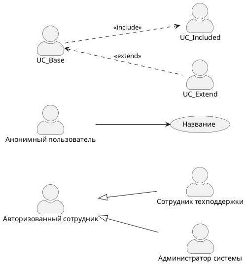

# Задания модуля 2: Сбор и документирование требований

## Задача 1
👉 [Посмотреть мое решение](solution_1.md)

Будем проектировать **один сквозной проект**. Это позволит увидеть, как требования превращаются в процессы, а процессы — в API.

**Назовем проект: "Корпоративный портал-помощник" (HelpDesk + База знаний).**

Мы делаем внутренний портал, где:
1. Сотрудник может найти ответ сам в **Базе знаний** (статьи).
2. Если не нашел — создать **заявку (тикет)** в техподдержку.
3. Поддержка обрабатывает заявки.

### Блок 1. Работа с требованиями

#### **Задание 1.1: Стейкхолдеры**
*Перечисли минимум 5 стейкххолдеров для нашего портала (Кто заинтересован в системе? Кто платит? Кто пользуется?).*  
*Для каждого стейкхолдера напиши его главную боль (что его не устраивает сейчас) и главную цель (что он хочет получить от системы).*

#### **Задание 1.2: Виды требований** 
*Разобрать функциональные и нефункциональные требования к порталу.*

#### **Задание 1.3: Архитектурно-значимые требования** 
*Какие 2-3 архитектурно-значимых требования ты бы выделил для этого портала? Почему они повлияют на выбор технологий?*

#### **Задание 1.4: Декомпозиция требований**
*Возьми одну большую функцию: «Сотрудник хочет создать заявку в техподдержку». Разбей эту функцию на более мелкие шаги/функции до тех пор, пока это не будет звучать как атомарное действие.*

### Блок 2. Документация процессов

Мы продолжаем проектировать наш Корпоративный портал-помощник (HelpDesk + База знаний).

**Контекст:**  
У нас есть четыре типа пользователей (акторов):
1. **Анонимный пользователь** (не авторизован)
2. **Авторизованный сотрудник** (любой работник компании)
3. **Сотрудник техподдержки** (оператор)
4. **Администратор системы**

#### Задание 2.1: Use Case Diagram - Use Case
*Напиши список вариантов использования (use cases) для каждого актора. Не надо пока рисовать, просто перечисли.
_Формат:_ Актор -> Действие (что он хочет сделать в системе).
_Пример:_ Авторизованный сотрудник -> Найти статью в базе знаний.
Постарайся для каждого актора написать по 3-5 действий. Подумай не только о позитивных сценариях (нашел статью), но и о том, зачем они вообще заходят в систему.*

#### Задание 2.2: Use Case Diagram - Определение Extend и Include
*Есть ли на твоей диаграмме Use Case, который обязательно включает в себя другой?
Пример: «Создать заявку» включает (include) в себя «Выбрать категорию проблемы»? Или «Прикрепить файл»?
Есть ли расширения (extend)?
Пример: «Закрыть заявку» может быть расширением для «Просмотра заявки» (закрыть можно только открыв заявку).*

#### Задание 2.3: Use Case Diagram - Создание с помощью PlantUML
*Вот синтаксис, который тебе понадобится:*
```


**Важно:**
- Для обобщения акторов стрелка идет **от наследника к родителю** (Support → Employee).
- Для extend стрелка идет **от расширяющего к базовому** (UC_Extend <.. UC_Base).
- Для include стрелка идет **от базового к включаемому** (UC_Base ..> UC_Included).


---


## Задача 2
👉 [Посмотреть мое решение](solution_2.md)
Выберите один из ваших пет-проектов (телеграм-бот для билетов или Москва-чекер) и составьте документ с требованиями.
### Структура документа
1. Цели и задачи проекта
2. Функциональные требования (сценарии использования)
3. Нефункциональные требования
4. Ограничения и допущения
5. Критерии приемки
### Требования к оформлению
- Используйте Markdown
- Добавьте рефлексию в конце (что было сложно, что узнали, какие вопросы остались)


---


